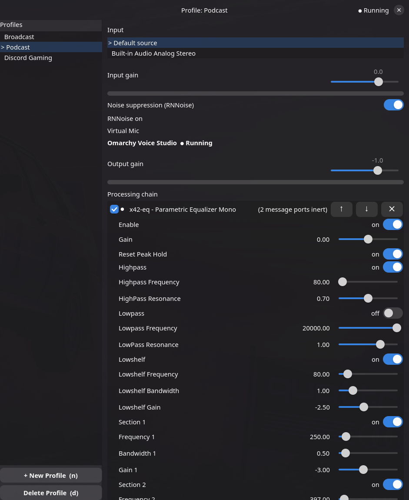

# Omarchy Voice Studio

> Your processed microphone, everywhere.

Native GTK4 voice-processing studio for Omarchy (Arch Linux / Wayland),
written in **D**. Takes a physical microphone, runs it through a
configurable chain (RNNoise → gain → LV2 plugins → gain), and exposes
the result as a **virtual PipeWire microphone** selectable in OBS,
Discord, browsers, and any other app. Keyboard-first, theme-following,
no Electron, no GStreamer.



## Build

```sh
# deps (Arch): gtk4 libadwaita pipewire lilv lv2 rnnoise ldc dub
dub build --compiler=ldc2
dub run   --compiler=ldc2                    # GUI
dub run   --compiler=ldc2 -- --headless      # service mode
```

## Documentation

- [docs/usage.md](docs/usage.md) — presets, daily use, keybindings,
  style modes, diagnostics
- [docs/lv2-plugins.md](docs/lv2-plugins.md) — bundled plugin suite and
  how to add more
- [docs/bundled-lv2.md](docs/bundled-lv2.md) — licenses/attribution for
  the vendored `lv2/` bundles
- [docs/architecture.md](docs/architecture.md) — code layout, PipeWire
  design, real-time rules

## License

MIT — see [LICENSE](LICENSE). 

[gid](https://github.com/Kymorphia/gid) is MIT GObject Introspection D Package Repository by elementgreen;
